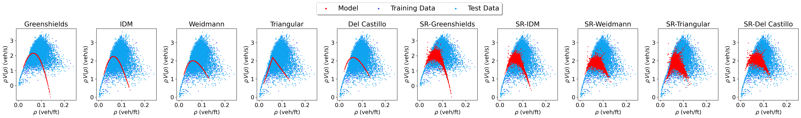

# SR-Traffic

<p align="center">

</p>

This repository contains the code used to produce the results of the paper [SR-Traffic: Discovering Macroscopic Traffic Flow Models with Symbolic Regression](https://ml4physicalsciences.github.io/2025/files/NeurIPS_ML4PS_2025_105.pdf)

## Installation

The dependencies are collected in `environment.yaml` and can be installed, after cloning the repository, using [`mamba`]("https://github.com/mamba-org/mamba"):

```bash
mamba env create -f environment.yaml
```

Once the environment is installed and activated, install the library using

```bash
pip install -e .
```

## Usage

To reproduce the paper's figures and error tables using the precomputed model
parameters, run

```bash
python src/sr_traffic/fd/results.py --road_name {road_name} --task {task_name}
```

where `{road_name}` is either `US101` or `I80`, and `{task_name}` is either
`prediction` or `reconstruction`. This script does not perform parameter
calibration or symbolic-regression search: it reruns the traffic simulations
with fixed parameters, evaluates the models, and writes the figures under
`results/<road_name>/<task_name>/`. Each run also writes its error table in
LaTeX and Markdown formats as `error_table.tex` and `error_table.md` in the same
directory.

To re-calibrate a given fundamental diagram, run

```bash
python src/sr_traffic/fd/calibration.py --config src/sr_traffic/fd/configs/{fnd_name}.yaml
```

where `{fnd_name}` is either `greenshields`, `triangular`, `weidmann`,
`del_castillo`, or `idm`.

This command calibrates only the predefined baseline diagrams; SR-discovered
models are searched for and fitted separately by the SR-Traffic pipeline below.

Each file in `src/sr_traffic/fd/configs/` defines one calibration problem:

- `road_name` selects the dataset (`I80` or `US101`).
- `task` selects the data split. `prediction` calibrates on earlier time points
  and tests on later ones, while `reconstruction` calibrates on a subset of
  spatial locations and tests on the held-out locations.
- `flux` is the case-sensitive name of the fundamental-diagram function in
  `src/sr_traffic/fd/diagrams.py`.
- `bounds` contains two lists: the lower bounds followed by the upper bounds.
  Their entries follow the order of the selected flux function's parameters
  after density, as listed below.
- `opt.num_ind` is the population size used by the PyGMO simple evolutionary
  algorithm, and `opt.num_gen` is the number of generations. The supplied
  values (`1000` and `100`) are full calibration settings and can be reduced
  for a quick trial.

| Config | Parameter order in `bounds` | Meaning |
| --- | --- | --- |
| `greenshields` | `v_max`, `rho_max` | Free-flow speed and jam density |
| `triangular` | `V_0`, `l_eff`, `T` | Free-flow speed, effective vehicle length, and time headway |
| `weidmann` | `v_max`, `rho_max`, `lambda_w` | Free-flow speed, jam density, and shape parameter |
| `del_castillo` | `C_jam`, `V_max`, `rho_max`, `theta` | Congested-wave speed scale, free-flow speed, jam density, and shape parameter |
| `idm` | `s0`, `T`, `delta`, `v0` | Minimum gap, time headway, acceleration exponent, and desired speed |

Calibration minimizes the average of the normalized squared density and
velocity errors on the training split. The data and parameters are
nondimensionalized by the preprocessing code, so the bounds are expressed in
the model's normalized units.

Finally, to perform a new model search with SR-Traffic, run

```bash
python -m sr_traffic.sr.sr_traffic
```

You can change the parameters of the algorithm by modifying `sr_traffic.yaml`.
The provided defaults use a seeded evolution with one individual and one
generation. This is intended as a quick smoke test of the implementation, not
as a search for a new model. Run artifacts, including `run.log`, are written to
`results/<road_name>/<task_name>/sr/` rather than the repository root.

### Selecting the baseline fundamental diagram for SR

SR-Traffic searches for a multiplicative correction to a predefined baseline
fundamental diagram. If the symbolic-regression individual is denoted by
`g_SR`, the flux used in the traffic simulation is

```text
q_SR(rho) = q_baseline(rho; opt_coeffs) * g_SR(rho).
```

The baseline is selected by the `gp.ansatz` entry in
`src/sr_traffic/sr/sr_traffic.yaml`. The default is

```yaml
ansatz:
  flux: triangular_flux
  v: triangular_v
  opt_coeffs: [0.37013956, 1.48964708, 6.59672108]
```

Thus, the default search modifies the triangular fundamental diagram. The
three coefficients are, in order, `V_0`, `l_eff`, and `T`. The baseline
coefficients are kept fixed during the SR run; the search changes `g_SR` and
fits the constants occurring in that expression.

To select another baseline, change all three fields in `ansatz`: `flux` is the
case-sensitive flux-function name, `v` is its matching velocity function, and
`opt_coeffs` follows the parameter order below.

| Baseline | `flux` | `v` | Order of `opt_coeffs` |
| --- | --- | --- | --- |
| Greenshields | `Greenshields_flux` | `Greenshields_v` | `v_max`, `rho_max` |
| Triangular | `triangular_flux` | `triangular_v` | `V_0`, `l_eff`, `T` |
| Weidmann | `Weidmann_flux` | `Weidmann_v` | `v_max`, `rho_max`, `lambda_w` |
| Del Castillo | `del_castillo_flux` | `del_castillo_v` | `C_jam`, `V_max`, `rho_max`, `theta` |
| IDM | `IDM_flux` | `inverse_IDM` | `s0`, `T`, `delta`, `v0` |

For example, an IDM baseline can be selected with

```yaml
ansatz:
  flux: IDM_flux
  v: inverse_IDM
  opt_coeffs: [s0, T, delta, v0]
```

where the placeholders must be replaced by numeric coefficients calibrated for
the selected `road_name` and `task`.

Notice that the `opt_coeffs` are obtained by calibrating the chosen baseline before running
symbolic regression. Run `src/sr_traffic/fd/calibration.py` with the appropriate
fundamental-diagram config, as described above. The calibration minimizes the
training density and velocity error and prints `pop.champion_x`; copy that
printed vector into `gp.ansatz.opt_coeffs`. This copy is currently manual: the
calibration script does not update `sr_traffic.yaml` automatically. Make sure
the calibration config's `road_name` and `task` match the corresponding SR
settings.

The coefficient vectors used for the paper's combinations of road, task, and
baseline are also stored as the `opt_*` variables in
`src/sr_traffic/fd/results.py`. The default triangular vector in
`sr_traffic.yaml`, `[0.37013956, 1.48964708, 6.59672108]`, is the stored
triangular calibration for I80/prediction. The commented IDM example currently
in that YAML, `[0.13046561, 0.74381154, 0.05752636, 0.54561196]`, comes from
US101/reconstruction, so it should not be used unchanged with the default
I80/prediction settings. The stored I80/prediction IDM vector is
`[0.43936351, 0.93094344, 0.16251414, 0.61353022]`.

### SR model score

The data error used to evaluate an SR model is the average of the relative
squared density and velocity errors:

```text
E_rho  = 100 * sum((rho_computed - rho_data)^2) / sum(rho_data^2)
E_v    = 100 * sum((v_computed - v_data)^2) / sum(v_data^2)
E_data = 0.5 * (E_rho + E_v).
```

Lower values are better. The factors of `100` express the two relative squared
errors as percentages. This quantity is a relative squared error, not a mean
squared error: the squared residuals are normalized by the squared norm of the
observations rather than by the number of observations. Although the simulated
flow is also computed, it is not included in `E_data`.

During the symbolic-regression search, the expression-tree length penalty from
`gp.penalty.reg_param` is added to the data error:

```text
E_fitness = E_data + reg_param * number_of_tree_nodes.
```

The default `reg_param` is `0.01`. The search minimizes `E_fitness`, thereby
trading off agreement with the observed density and velocity against symbolic
expression complexity. A candidate receives a data error of `100` if it fails
the velocity feasibility check, which requires velocity to be non-increasing
with density. Invalid expressions and expressions rejected by the tree checks
are penalized similarly.

The final test error printed after the search is `E_data` alone; it does not
include the expression-length penalty.

## Citing

```
@article{manti2025,
  title={{SR}-{T}raffic: {D}iscovering {M}acroscopic {T}raffic {F}low {M}odels with {S}ymbolic {R}egression},
  author={Manti, S. and Mohammadian, S. and Treiber, M. and Lucantonio, A.},
  journal={Neural Information Processing Systems, ML4PS Workshop},
  year={2025}
}
```

## Acknowledgements

This work is supported by the European Union (European Research Council (ERC), ALPS, 101039481). Views and opinions expressed are however those of the author(s) only and do not necessarily reflect those of the European Union or the ERC Executive Agency. Neither the European Union nor the granting authority can be held responsible for them.
